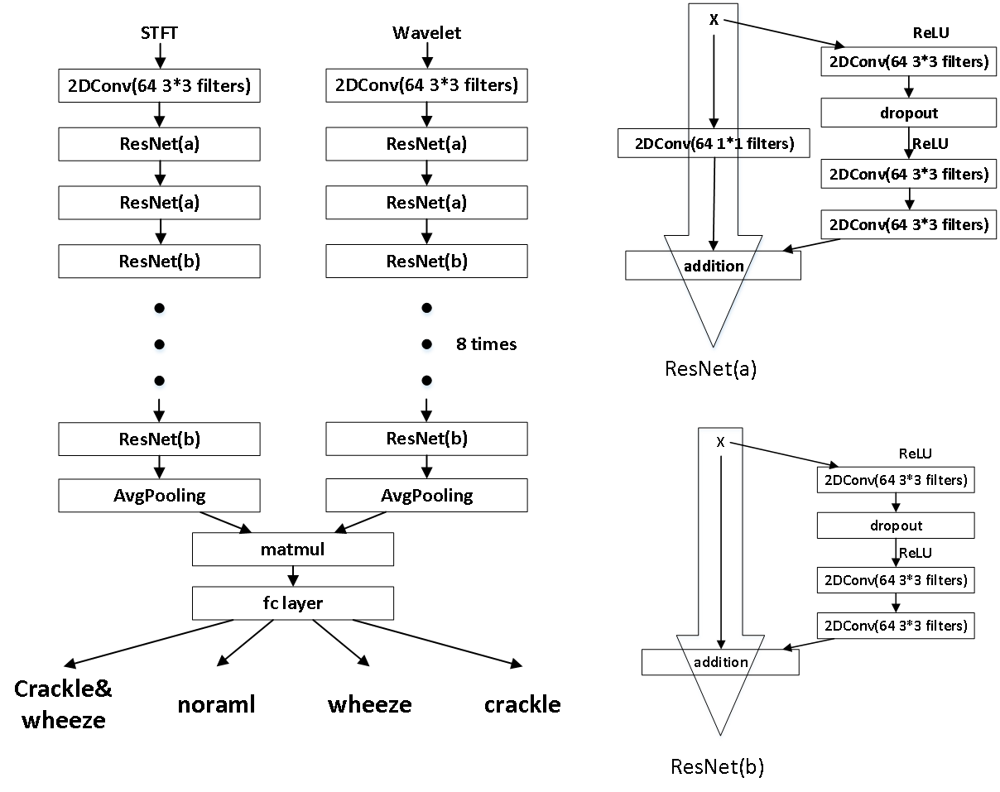

# Lung Sound Classification System - LungSys I

This repository contains the 1) Bi-ResNet for lung sound deep learning classification model, published in [this paper](https://ieeexplore.ieee.org/document/8919021). 2) Lung classification system based on a digital stethoscope and an android application, published in [this paper](https://ieeexplore.ieee.org/document/8918752)

<!-- TABLE OF CONTENTS -->
## Table of Contents

* [Bi-ResNet](#Bi-ResNet)
  * [Pre-processing](#Pre-processing)
  * [Feature](#Feature)
  * [Train](#Train)
  * [Performance](#Performance)
* [LungSys](#LungSys)
  * [tf-lite](#tf-lite)
  * [Android](#Android)
* [Author](#Author)
* [License](#License)

## Bi-ResNet

The architecture of our Bi-ResNet. The input of stft and wavelet are short-time Fourier transform spectrogram and wavelet parameter of one sample

## Pre-processing

In order to train the model, you need to download ICBHI 2017 database [here](https://bhichallenge.med.auth.gr/). Each sample provided by this database contains several breath cycles. So you need to clip them according to the start and end time declared officialy. Then you need to divide them into train set and test set. Here we divide them based on official suggestion.

The class to clip samples and divide database are concluded in
```
Bi-Resnet/pre-processing/stft.py
```
named `clip_cycle` and `clip_test` respectively.

## Feature

We implement short-time Fourier transform(stft) and wavelet analysis here to analyze lung sound. you can run 
```
Bi-Resnet/pre-processing/stft.py
Bi-Resnet/pre-processing/wavelet.py
```
respectively and store the spectrogram and wavelet parameter as a picture locally. Then
```
Bi-Resnet/pre-processing/pack.py
```
helps you to store stft spectrogram, wavelet parameters and label into `Bi-Resnet/analysis/pack/wavelet_stft_train.p` and `Bi-Resnet/analysis/pack/wavelet_stft_test.p`

## Train

The model was built using PyTorch, please read detail in 
```
Bi-Resnet/model/bnn.py
```
And it's running commands based on shell:
```
sh run.sh
```

## Performance

Comparison with state-of-the art works:


Confusion matrix:


   
## LungSys

The lung system amied at detecting adventitious respiratory lung sound.  Our Lung system contains a digital stethoscope and an android application. The stethoscope is used to record lung sound and to transmit the data via Bluetooth to our Android mobile tablet. Then our android application detects the start point of each breath cycle and clips the record according to it. Finally, after computing based on Bi-ResNet, our software will present the amount of breth cycle belonging to each class. Here is the main UI of our software. 

## tf-lite

Considering the stability, we choose TensorFlow-Lite to implement the neural network on android platform. We rewrite the Bi-ResNet in TensorFlow and use `TFLiteConverter` to get tflite model. in this step, parameters of out tflite model is totally equal to them of model built in PyTorch. you can find detail in 
```
tflite/bnn_tf_ckpt.py
```
and version of TensorFlow Lite is 1.15

## Android

Our android project is built based on [demo](https://github.com/tensorflow/examples/tree/master/lite/examples/object_detection/android) provided by TensorFlow.
To built our own android project, we need to put `tflite` file into 
```
android/app/src/main/assets
```
and make declaration in
```
android/app/src/main/java/org/tensorflow/lite/examples/detection/DetectorActivity.java
```
We also finished the work of feature extraction and pre-processing, which is similar to the work in training Bi-ResNet. Code for this part can be found in 
```
android/app/src/main/java/org/tensorflow/lite/examples/detection/CameraActivity.java
```

## Authors

* **Yi Ma** 
* **Xinzi Xu**
* **Qin Yu**
* **Yuhang Zhang**
* **Jian Zhao**
* **Guoxing Wang**
* **Yongfu Li***

## License

Please cite these papers if you have used part of this work.
```
Y. Ma, et al., "LungBRN: A Smart Digital Stethoscope for Detecting Respiratory Disease Using bi-ResNet Deep Learning Algorithm," 2019 IEEE Biomedical Circuits and Systems Conference (BioCAS), Nara, Japan, 2019, pp. 1-4.
 Citation & Abstract
Y. Ma, et al., "Live Demo: LungSys - Automatic Digital Stethoscope System For Adventitious Respiratory Sound Detection," 2019 IEEE Biomedical Circuits and Systems Conference (BioCAS), Nara, Japan, 2019, pp. 1-1.
```
